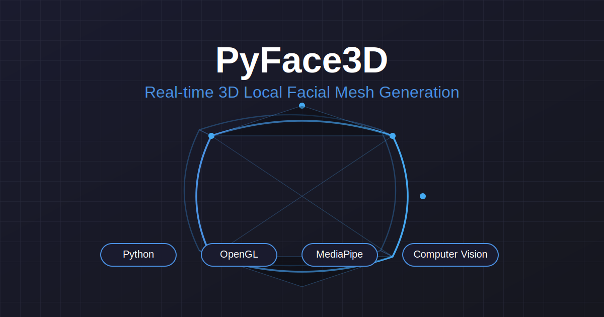

<div align="center">

# PyFace3D - Face Model Generator

[](https://www.python.org/downloads/)
[](https://opensource.org/licenses/MIT)
[](http://makeapullrequest.com)
[](https://GitHub.com/Dor-sketch/PyFace3D/graphs/commit-activity)
[](https://GitHub.com/Dor-sketch/PyFace3D/issues/)
[](https://Dor-sketch.github.io/PyFace3D/)



Real-time 3D face modeling application that captures facial landmarks using your webcam and generates a textured 3D mesh model. Features split-screen interface showing both live camera feed and interactive 3D model.

[Demo](https://dorpascal.com/PyFace3D/) •
[Installation](#installation) •
[Documentation](#technical-details) •
[Contributing](#contributing)

</div>

---

## ✨ Features

- 🎥 Real-time face landmark detection using MediaPipe
- 🔮 Live 3D mesh generation with Delaunay triangulation
- 🖼️ Interactive 3D model viewer with texture mapping
- 📺 Split-screen display showing camera feed and 3D model
- 🖱️ Model rotation using mouse controls
- 💾 Export functionality for 3D models (OBJ format with textures)

## 🚀 Quick Start

### Prerequisites

- Python 3.7+
- OpenGL-compatible graphics card
- Webcam
- 4GB+ RAM

### Installation

1. Clone the repository:

    ```bash
    git clone https://github.com/Dor-sketch/PyFace3D.git
    cd PyFace3D
    ```

2. Create and activate a virtual environment (optional but recommended):

    ```bash
    # Windows
    python -m venv venv
    .\venv\Scripts\activate

    # macOS/Linux
    python3 -m venv venv
    source venv/bin/activate
    ```

3. Install dependencies:

    ```bash
    pip install -r requirements.txt
    ```

### Dependencies

[](https://opencv.org/)
[](https://numpy.org/)
[](https://mediapipe.dev/)
[](https://www.pygame.org/)
[](http://pyopengl.sourceforge.net/)
[](https://scipy.org/)

## 🎮 Usage

1. Activate virtual environment (if used):

    ```bash
    # Windows
    .\venv\Scripts\activate

    # macOS/Linux
    source venv/bin/activate
    ```

2. Run application:

    ```bash
    python3 main.py
    ```

### Controls

| Key/Action | Description |
|------------|-------------|
| Left Mouse + Drag | Rotate 3D model |
| S | Save model as OBJ |
| R | Reset rotation |
| Close Window | Exit application |

## 🏗️ Architecture

<details>
<summary>Click to expand architecture details</summary>

### 1. Face Detection and Landmark Tracking

- MediaPipe Face Mesh (468 landmarks)
- Real-time confidence scoring
- Smooth landmark transitions

### 2. 3D Mesh Generation

- 3D coordinate mapping
- Delaunay triangulation
- Normal vector calculation
- Texture coordinate mapping

### 3. Rendering Pipeline

- OpenGL-based rendering
- Split viewport management
- Dynamic texture updating
- Lighting system

### 4. Performance Optimization

- Configurable frame buffering
- Resolution scaling
- Memory management
- Vertex optimization

</details>

## 💾 Output Files

Models are saved with timestamp-based naming:

```plaintext
face_model_[timestamp].obj    # Geometry
face_model_[timestamp].mtl    # Materials
face_texture_[timestamp].png  # Texture
```

## 🔧 Troubleshooting

This project has been tested on a MacBook Air M2 using Python 3.11.

<details>
<summary>Common Issues</summary>

### Camera Detection

- ✓ Check webcam connection
- ✓ Verify system permissions
- ✓ Try alternate camera index

### Performance

- ✓ Adjust process_resolution
- ✓ Modify max_buffer_size
- ✓ Ensure proper lighting

### OpenGL

- ✓ Update graphics drivers
- ✓ Verify PyOpenGL installation
- ✓ Check version compatibility

</details>

## 🤝 Contributing

[](https://github.com/Dor-sketch/PyFace3D/graphs/contributors)

Contributions are welcome! Contributions guidelines will be added soon.

## 📝 License

[](LICENSE)

This project is licensed under the MIT License - see the [LICENSE](LICENSE) file for details.

## 🙏 Acknowledgments

- MediaPipe team for face mesh solution
- OpenGL and PyOpenGL communities
- Contributors to numpy, scipy, and pygame

---

<div align="center">

Made with ❤️ by [Dor Pascal](https://dorpascal.com/)

[](https://github.com/Dor-sketch)
[](https://www.linkedin.com/in/dor-pascal/)
[](https://twitter.com/DorPascalLab)

[](https://github.com/Dor-sketch/PyFace3D/stargazers)
[](https://github.com/Dor-sketch)

</div>
